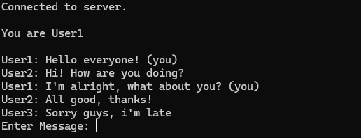
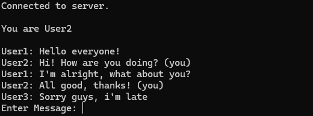
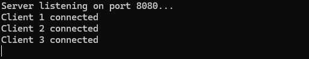

# TCP-Protocol-Simulator
A C++ implementation that simulates TCP protocol communication in a controlled local environment. This educational project demonstrates socket programming, multi-threading, and client-server architecture through a terminal-based messaging system running on localhost.

# 🖥️ TCP Protocol Simulator

A simple **TCP-based chat simulation** that allows up to **three clients** to communicate through a central **server**. The server assigns unique usernames to each client and facilitates real-time message exchange.

## 🚀 Features
✅ **Simulates TCP-based message exchange**  
✅ Supports up to **3 clients**  
✅ **Multi-threaded server** for handling multiple connections  
✅ **Unique usernames** assigned dynamically  
✅ **Real-time message synchronization** between clients  
✅ **Clear terminal UI** with proper spacing  

## 📷 Screenshots
User1 view

User2 view

User3 view

User4 view

## ⚙️ How It Works
1. The **server** listens for incoming TCP connections.  
2. When a client connects, it is assigned a **username (User1, User2, etc.)**.  
3. Clients can send and receive messages **in real time**.  
4. The server **broadcasts** messages to all clients except the sender.  
5. Messages are displayed clearly in the **client's terminal UI**.

